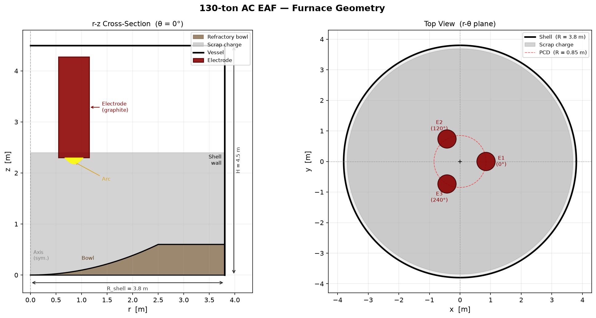
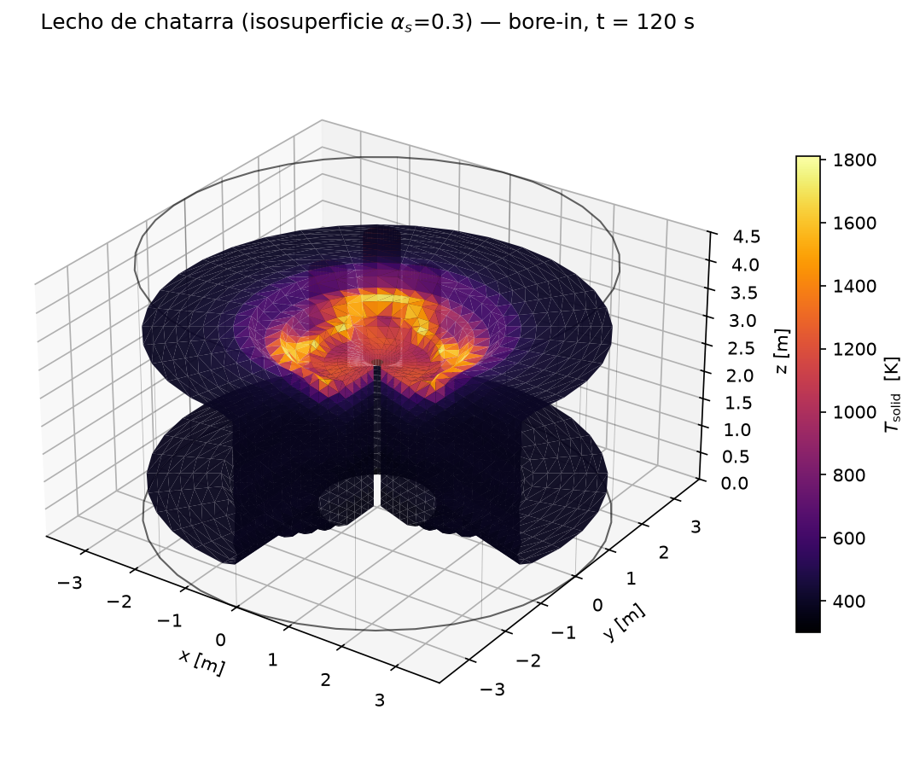

# EAF3D — Simulador Multifísica 3D de Horno Eléctrico de Arco

Implementación computacional del modelo de Ugarte et al. (2024) *Materials* **17**(21), 5139, extendida hacia gemelo digital.
Simulación CFD 3D de fusión de chatarra/HBI en un horno eléctrico de arco (EAF) de 130 t AC: Fortran 2008 + MPI + HDF5 paralelo.

## Geometría

Dominio cilíndrico (r, θ, z) de un EAF de 130 t: coraza de R = 3.8 m y H = 4.5 m,
crisol refractario parabólico (R = 2.5 m, profundidad 0.6 m) y tres electrodos de
grafito (R = 0.30 m) sobre un círculo de paso de R = 0.85 m, a 120° entre sí.



El estado del lecho de chatarra sale directamente de los snapshots HDF5 del
simulador. Ejemplo real (bore-in, t = 120 s): los arcos perforan el anillo
caliente bajo los electrodos mientras el resto del lecho sigue frío.

<p align="center">

</p>

Ambas figuras se regeneran con
`python3 scripts/eaf_geometry_simple.py` y
`python3 postprocess/plot_geometry_3d.py [snapshot.h5]`.

---

## Características

| Módulo | Método |
|--------|--------|
| Flujo multifase | Euler–Euler (gas + líquido + sólido dual-cell), flujos de cara conservativos |
| Acoplamiento P-V | SIMPLE con corrección de presión CG; gas activo low-Mach (acústica ρ(p,T)) |
| Turbulencia | k-ε estándar |
| Arco eléctrico | Cassie–Mayr + radiación Monte Carlo + Lorentz + impingement |
| Radiación térmica | Ordenadas Discretas S4 (24 direcciones); S6/S8 opcionales (`do_quadrature`) |
| Fusión/Solidificación | Entalpía efectiva + colapso de chatarra + arrastre Ergun |
| Química | C→CO (Maahs) + CO→CO₂, con O₂ transportado y finito (horno sellado) |
| Transporte de especies | Convección-difusión O₂ / CO / CO₂ |
| Escoria | Pseudo-fase multicomponente (FeO/CaO/SiO₂/MgO/C) con flotabilidad y ciclo Fe (oxidación/reducción) |
| Espuma de escoria | Ventana de Pretorius ξ(B₂, X_FeO, T); atributo óptico acoplado a DO y arco |
| Alimentación continua | Banda ECS con perfil de caudal (`solve_ecs`), conservación exacta |
| Auditoría | Balance global de masa/energía por paso (`audit.csv`, 44 columnas; ver Apéndice del paper) |
| Paralelización | Descomposición de dominio θ×z + halo exchange (2 celdas) |
| Salida | HDF5 paralelo (PHDF5 con MPI-IO) |

---

## Requisitos

| Herramienta | Versión mínima | macOS (Homebrew) |
|-------------|---------------|------------------|
| GFortran/mpif90 | GCC 11+ | `brew install open-mpi` |
| HDF5 (Fortran + MPI) | 1.12+ | `brew install hdf5-mpi` |
| GNU Make | 4.0+ | incluido en Xcode CLT |
| Python 3 (post-proceso) | 3.9+ (h5py, matplotlib; skimage/scipy para 3D) | `brew install python` |

```bash
# Verificar instalación
mpif90 --version
h5fc --version
```

---

## Compilación

```bash
git clone <repo>
cd hornofusion-full3D

make            # -O2 + bounds check (desarrollo)
make debug      # -O0 -g -fbacktrace (depuración)
make opt        # -O3 -march=native (producción)
```

El binario se genera en `bin/eaf3d_mpi`.

---

## Ejecución rápida

### Test pequeño (malla 12×24×16)

```bash
mpirun -n 8 ./bin/eaf3d_mpi input/config_small_test.dat
```

### Corrida de producción (malla 60×120×84, física completa)

```bash
mkdir -p output_prod
make clean && make opt
mpirun -n 12 ./bin/eaf3d_mpi input/config_production_full.dat 2>&1 | tee run_production.log
tail -f output_prod/monitor.log
```

La descomposición es en θ×z (r nunca se descompone): `ntheta` y `nz` deben ser
divisibles por la grilla de procesos. Válidos para producción: 8, 12, 16, 24.
Ver `docs/RUNNING.md`.

---

## Suite de pruebas

```bash
make test-quick   # gate por commit (~1 min): corrida fría + invariantes + golden
make test-full    # gate por etapa (~5-10 min): unit + matriz MPI + simetría
make test-unit    # unit tests Fortran (TDMA, malla, entalpía, flujos de cara, S_N, Pretorius…)
STAGE=vN make test-rebaseline   # regenerar golden tras un cambio numérico intencional
```

Los golden y los XFAIL esperados (con causa raíz) viven en `tests/`; ver
`tests/README.md`. El balance de masa/energía del `audit.csv` es un gate de
regresión: toda ruta nueva de masa o energía se audita.

---

## Estructura del repositorio

```
hornofusion-full3D/
├── src/            ~40 módulos Fortran, uno por concern (mod_energy_3d,
│                   mod_arc_cassie_mayr, mod_slag_chemistry, mod_ecs_feed, …)
│                   main_3d.f90 orquesta el paso temporal
├── input/          Configs `key = value` (config_production_full.dat, …)
├── tests/          Unit + integración + golden + matriz MPI (run_tests.sh)
├── scripts/        run_campaign.py (campañas), hdf5_to_vtk.py, analyze_*.py
├── campaigns/      Definiciones JSON + audit/config de campañas (C2/C3/C4/S4/S5)
├── postprocess/    plot_insights.py, render_3d_video.py, plot_geometry_3d.py
├── paper/          Manuscrito (MNRAS) con el working plan del proyecto
└── docs/           ARCHITECTURE / PHYSICS / CONFIGURATION / OUTPUT / RUNNING
```

---

## Configuraciones disponibles

| Archivo | Malla | Uso |
|---------|-------|-----|
| `config_small_test.dat` | 12×24×16 | Humo / regresión rápida |
| `config_300s_borein.dat` | 18×36×24 | Bore-in con física completa |
| `config_medium.dat` | 35×70×50 | Pruebas intermedias |
| `config_production_full.dat` | 60×120×84 | **Producción** (tap-to-tap) |

Toda la física es conmutable por flags `solve_*` sin recompilar; referencia
completa de claves en `docs/CONFIGURATION.md`.

---

## Verificación rápida de la salida

```python
import h5py

with h5py.File('output/eaf3d_00000001.h5', 'r') as f:
    print(list(f['fields'].keys()))          # lista de campos
    T_gas = f['fields/T_gas'][:]             # temperatura del gas [K]
    a_s = f['fields/alpha_solid'][:]         # fracción de sólido
    print(f"max(T_gas) = {T_gas.max():.1f} K, max(alpha_s) = {a_s.max():.3f}")
```

Y el balance global por paso queda en `output*/audit.csv`
(`tests/integration/check_audit.py` lo verifica).

---

## Referencias

- Ugarte et al. (2024) *Materials* **17**(21), 5139 — modelo base
- Cassie (1950), Mayr (1943) — modelo de arco
- Maahs (1986) — oxidación de carbono
- Ergun (1952) — arrastre en lecho poroso
- Pretorius & Carlisle (1999) — ventana de espuma de escoria

---

## Documentación detallada

| Documento | Contenido |
|-----------|-----------|
| [`docs/PHYSICS.md`](docs/PHYSICS.md) | Ecuaciones gobernantes, todos los modelos físicos |
| [`docs/ARCHITECTURE.md`](docs/ARCHITECTURE.md) | Estructura del código, tipos, MPI, bugs críticos resueltos |
| [`docs/CONFIGURATION.md`](docs/CONFIGURATION.md) | Referencia completa de parámetros de config |
| [`docs/OUTPUT.md`](docs/OUTPUT.md) | Formato HDF5, campos disponibles, post-proceso Python |
| [`docs/RUNNING.md`](docs/RUNNING.md) | Cómo correr: mallas, ranks válidos, monitoreo |
